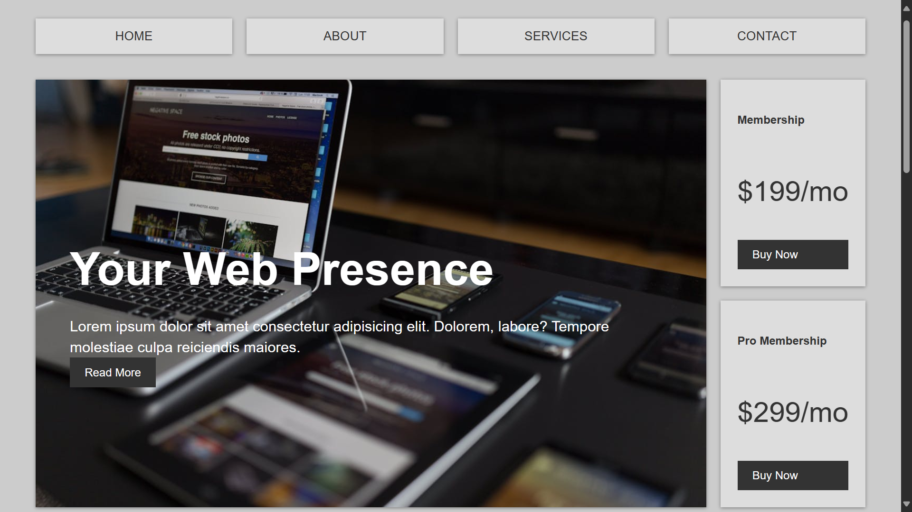
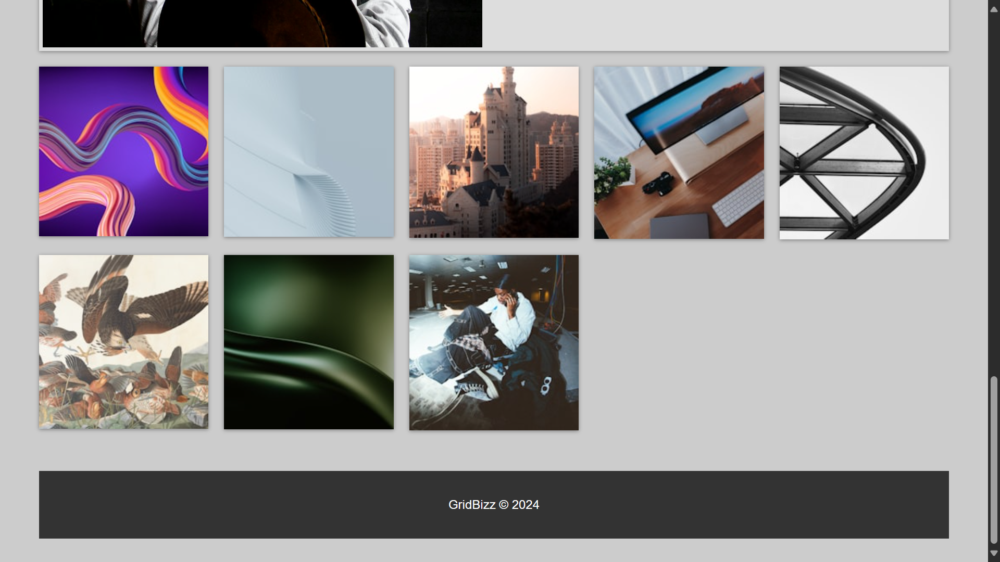

# Grid Bizz Page

Welcome to the **Grid Bizz Page** project! This project is a service offering webpage designed with a focus on modern design and responsive layouts.

## Project Description

This project demonstrates a business webpage that showcases the various services offered by a company. It features a responsive design, making it compatible with a variety of devices and screen sizes. The layout is implemented using CSS grid to achieve a clean and organized look.

## Technologies Used

The following technologies were used to build this project:
- **HTML**: Provides the structure and content for the webpage.
- **CSS**: Handles the styling, including layout and responsiveness.

## Live Demo

You can view a live demo of the project here:
[Grid Bizz Page on Netlify](https://grid-bizz-page.netlify.app/)

## Screenshots

Here are some screenshots showcasing the design and layout of the webpage:

## Getting Started

To run this project locally, follow these steps:
1. Clone the repository: git clone https://github.com/Bilal00404/grid-bizz-page.git
2. Navigate to the project directory: cd grid-bizz-page
3. Open the HTML file in your preferred browser.

## Contact
If you have any questions or suggestions, feel free to contact me at bilalchanna67@gmail.com.

